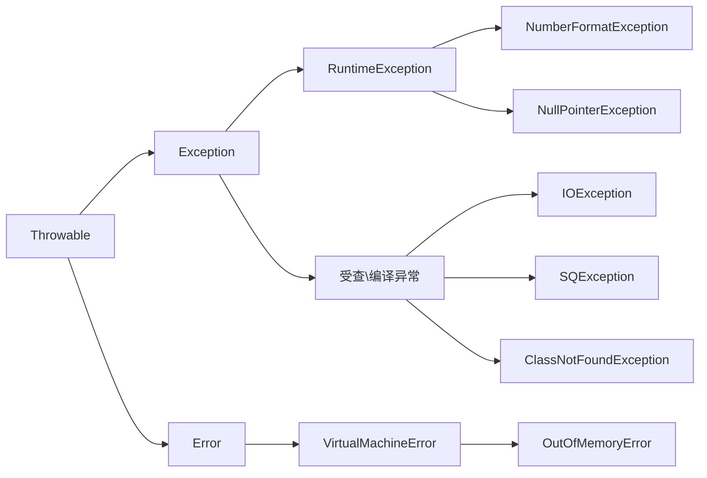

~~~
Error:程序无法处理
Exception:运行时异常和非运行时异常 程序可以处理
受查\编译异常:编译器要求必须处置的异常
~~~

#### RuntimeException

RuntimeException|Desc
-|-
ArrayIndexOutOfBoundsException|数组索引越界异常
IllegalArgumentException|非法参数
NullPointerException|空指针
ClassCastException|类型转换
