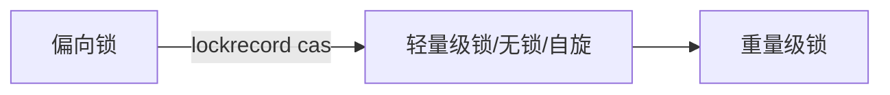

### cas
* compare and swap/compare and exchange
* ABA (添加version 标签) AtomicStampedReference

### 锁升级
* 锁信息储存对象头markword 64位
* 无锁状态
25(unused) 31(有调用hashCode存hashcode不调用空) 1 4(分代年龄) 1(偏向锁) 2(锁标志位)

### synchronized lock
* lock接口 手动释放 可以获取状态
* synchronized 关键字
