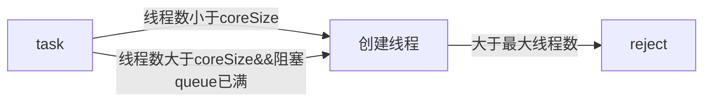

### Threadpool

param|desc
-|-
corePoolSize|核心线程数
maximumPoolSize|最大线程池大小
keepAliveTime|线程最大空闲时间
unit|
workQueue|
threadFactory|
handler|拒绝策略

### 功能线程池
* 定长线程池（FixedThreadPool）
  只有核心线程 & 不会被回收、线程数量固定、任务队列无大小限制

* 定时线程池（ScheduledThreadPool ）
  核心线程数量固定、非核心线程数量无限制（闲置时马上回收）

* 可缓存线程池（CachedThreadPool）
  只有非核心线程、线程数量不固定（可无限大）、灵活回收空闲线程（具备超时机制，全部回收时几乎不占系统资源、新建线程（无线程可用时）

* 单线程化线程池（SingleThreadExecutor）
  只有一个核心线程（保证所有任务按照指定顺序在一个线程中执行，不需要处理线程同步的问题）

### ThreadPoolExecutor

